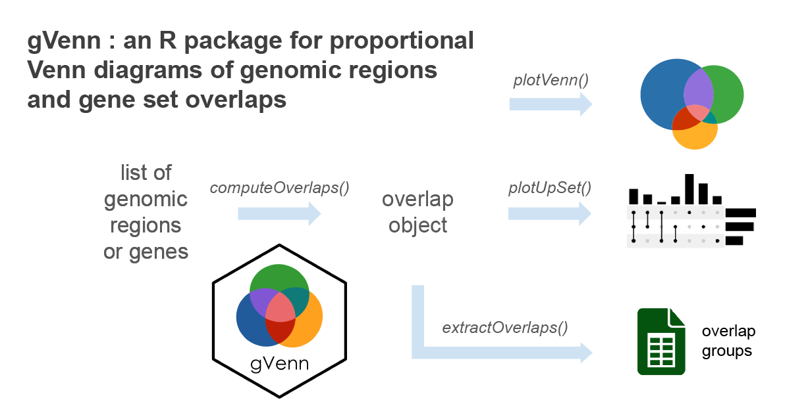

<!-- README.md is generated from README.Rmd. Please edit that file -->

```{r, include = FALSE}
knitr::opts_chunk$set(
  collapse = TRUE,
  comment = "#>",
  fig.path = "man/figures/README-",
  out.width = "100%"
)
```

# gVenn


[](https://doi.org/10.5281/zenodo.17918547)

**Proportional Venn diagrams for genomic regions and gene set overlaps**

<p align="center">
  
</p>

**gVenn** stands for **gene/genomic Venn**.  
It provides tools to compute overlaps between genomic regions or sets of genes
and visualize them as Venn diagrams with areas proportional to the number of 
overlapping elements. With seamless support for `GRanges` and `GRangesList` 
objects, **gVenn** integrates naturally into Bioconductor workflows such as 
ChIP-seq, ATAC-seq, or other interval-based analyses, and produces clean, 
publication-ready figures.

<p align="center">

</p>

> The gVenn hex logo was generated using the [hexSticker](https://github.com/GuangchuangYu/hexSticker) R package ([code](https://github.com/ckntav/gVenn_manuscript/blob/main/scripts/generate_hex_sticker_logo/02_generate_hex_sticker.R))


## Installation

The gVenn package is available through Bioconductor and GitHub.

You can install it from Bioconductor using:
```{r, install-bioconductor, eval=FALSE}
if (!require("BiocManager", quietly = TRUE))
    install.packages("BiocManager")
BiocManager::install("gVenn")
```

To install the development version from GitHub, use:

```{r, install-github, eval=FALSE}
# install.packages("pak")  # if not already installed
pak::pak("ckntav/gVenn")

# or, alternatively:
# install.packages("devtools")  # if not already installed
devtools::install_github("ckntav/gVenn")
```

## Documentation

For comprehensive documentation and vignettes, visit the [gVenn documentation page](https://ckntav.github.io/gVenn/).

## Quick start

This quick example demonstrates how to compute overlaps between ChIP-seq 
peaks and visualize them with both a Venn diagram and an UpSet plot.

### 1. Load example ChIP-seq data and compute overlaps
```{r, example_ov}
library(gVenn)

# Example dataset of ChIP-seq peaks (A549 cell line, 3 set of genomic regions)
data(a549_chipseq_peaks)

# Compute overlaps
ov <- computeOverlaps(a549_chipseq_peaks)
```

### 2. Visualize
```{r, example_venn, dpi=300}
# Draw Venn diagram
plotVenn(ov)
```

```{r, example_upset, fig.width=5, fig.height=2.5, dpi=300}
# Draw UpSet plot (useful for larger numbers of sets)
plotUpSet(ov)
```

### 3. Extract elements per overlap group
```{r, extractOverlaps_example1}
groups <- extractOverlaps(ov)
```
```{r, extractOverlaps_example2}
# Display the number of genomic regions per overlap group
sapply(groups, length)
```

In this example:

 - 243 peaks are shared across all three factors (MED1, BRD4, and GR)
 - 267 peaks are unique to BRD4
 - 48 peaks are shared between MED1 and BRD4 only

#### Overlap group naming
When overlaps are computed, each group of elements or genomic regions is
labeled with a binary code that indicates which sets the element belongs to.

 - Each digit in the code corresponds to one input set (e.g., A, B, C).
 - A 1 means the element is present in that set, while 0 means absent.
 - The group names in the output are prefixed with "group_" for clarity.

<div align="center">
| Group name   | Meaning                       |
|--------------|-------------------------------|
| `group_100`  | Elements only in **A**        |
| `group_010`  | Elements only in **B**        |
| `group_001`  | Elements only in **C**        |
| `group_110`  | Elements in **A ∩ B** (not C) |
| `group_101`  | Elements in **A ∩ C** (not B) |
| `group_011`  | Elements in **B ∩ C** (not A) |
| `group_111`  | Elements in **A ∩ B ∩ C**     |
</div>

#### Retrieve one particular overlap group
Each overlap group can be accessed directly by name for downstream analyses,
including motif enrichment, transcription factor (TF) enrichment, annotation of
peaks to nearby genes, functional enrichment or visualization.

For example, to extract all elements that are present in **A ∩ B ∩ C**:

```{r, extractOverlaps_example3}
# Extract elements in group_111 (present in all three sets: MED1_Dex_chr7, BRD4_Dex_chr7, GR_Dex_chr7)
peaks_in_all_sets <- groups[["group_111"]]

# Display the elements
peaks_in_all_sets
```

## Contributing

Pull requests are welcome. If you find a bug, have a suggestion, or want to
add a feature, please open an issue first to discuss what you would like
to change.
