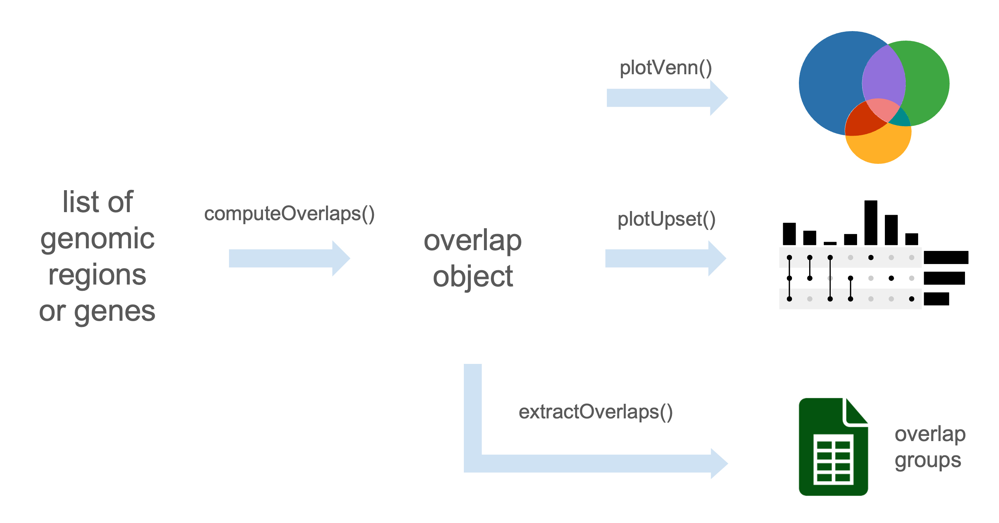
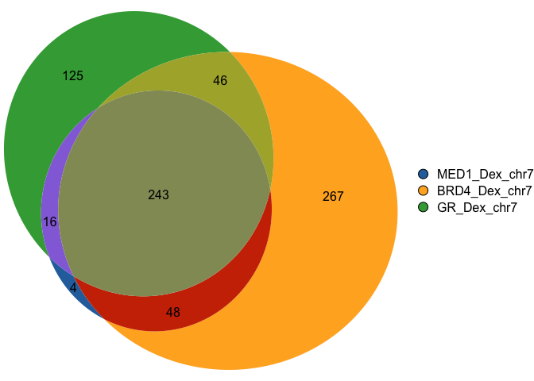
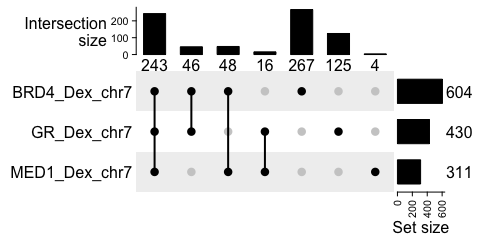

<!-- README.md is generated from README.Rmd. Please edit that file -->

# gVenn

<!-- badges: start -->

<!-- badges: end -->

<!-- Float the image to the right -->


**Proportional Venn and UpSet diagrams for genomic regions and gene set
overlaps.**

**gVenn** stands for **gene/genomic Venn**.  
It provides tools to compute overlaps between genomic regions or sets of
genes and visualize them as Venn diagrams with areas proportional to the
number of overlapping elements. With seamless support for `GRanges` and
`GRangesList` objects, **gVenn** integrates naturally into Bioconductor
workflows such as ChIP-seq, ATAC-seq, or other interval-based analyses,
and produces clean, publication-ready figures.



## Installation

You can install the development version of gVenn from
[GitHub](https://github.com/) with:

``` r
# install.packages("pak")
pak::pak("ckntav/gVenn")
```

## Quick start

This quick example demonstrates how to compute overlaps between ChIP-seq
peaks and visualize them with both a Venn diagram and an UpSet plot.

### 1. Load example ChIP-seq data and compute overlaps

``` r
library(gVenn)

# Example dataset of ChIP-seq peaks (A549 cell line, 3 genomic regions)
data(a549_chipseq_peaks)

# Compute overlaps
ov <- computeOverlaps(a549_chipseq_peaks)
#> Loading required namespace: GenomicRanges
```

### 2. Visualize

``` r
# Draw Venn diagram
plotVenn(ov)
```



``` r
# Draw UpSet plot (useful for larger numbers of sets)
plotUpSet(ov)
```



### 3. Extract elements per overlap group

``` r
groups <- extractOverlaps(ov)

# display the number of genomic regions per overlap group
sapply(groups, length)
#> group_010 group_001 group_100 group_110 group_011 group_101 group_111 
#>       267       125         4        48        46        16       243
```

## Contributing

Pull requests are welcome.
