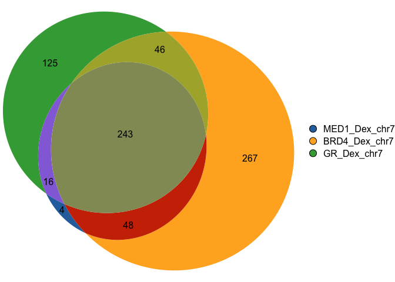

<!-- README.md is generated from README.Rmd. Please edit that file -->

# gVenn

<!-- badges: start -->

<!-- badges: end -->

**gVenn** stands for **gene/genomic Venn**.  
It provides tools to compute overlaps between sets of gene or genomic
regions and visualize them as Venn diagrams with areas proportional to
the number of overlapping elements. With seamless support for `GRanges`
and `GRangesList` objects, **gVenn** integrates naturally into
Bioconductor workflows such as ChIP-seq, ATAC-seq, or other
interval-based analyses, and produces clean, publication-ready figures.

## Installation

You can install the development version of gVenn from
[GitHub](https://github.com/) with:

``` r
# install.packages("pak")
pak::pak("ckntav/gVenn")
```

## Quick start

This is a basic example which shows you how to solve a common problem:

``` r
library(gVenn)

data(a549_chipseq_peaks)

ov <- computeOverlaps(a549_chipseq_peaks)
#> Loading required namespace: GenomicRanges
plotVenn(ov)
```



## Citation

If you use `gVenn` in your work, please cite it appropriately (coming
soon).

## Contributing

Pull requests are welcome. For major changes, please open an issue first
to discuss what you’d like to change.
