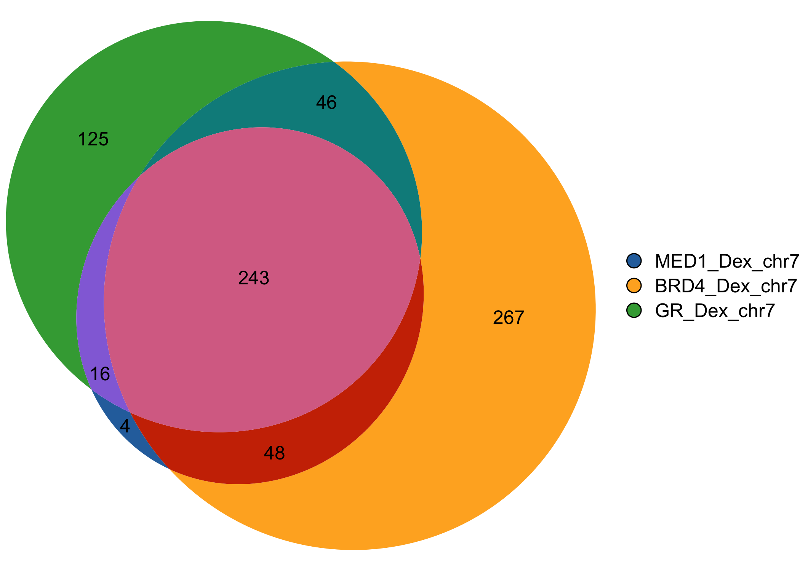

<!-- README.md is generated from README.Rmd. Please edit that file -->

# gVenn

<!-- badges: start -->

<!-- badges: end -->

**Proportional Venn and UpSet diagrams for genomic regions and gene set
overlaps.**

<p align="center">


</p>

**gVenn** stands for **gene/genomic Venn**.  
It provides tools to compute overlaps between genomic regions or sets of
genes and visualize them as Venn diagrams with areas proportional to the
number of overlapping elements. With seamless support for `GRanges` and
`GRangesList` objects, **gVenn** integrates naturally into Bioconductor
workflows such as ChIP-seq, ATAC-seq, or other interval-based analyses,
and produces clean, publication-ready figures.


## Installation

You can install the development version of gVenn from
[GitHub](https://github.com/) with:

``` r
# install.packages("pak")
pak::pak("ckntav/gVenn")
```

## Quick start

This quick example demonstrates how to compute overlaps between ChIP-seq
peaks and visualize them with both a Venn diagram and an UpSet plot.

### 1. Load example ChIP-seq data and compute overlaps

``` r
library(gVenn)

# Example dataset of ChIP-seq peaks (A549 cell line, 3 genomic regions)
data(a549_chipseq_peaks)

# Compute overlaps
ov <- computeOverlaps(a549_chipseq_peaks)
#> Loading required namespace: GenomicRanges
```

### 2. Visualize

``` r
# Draw Venn diagram
plotVenn(ov)
```



``` r
# Draw UpSet plot (useful for larger numbers of sets)
plotUpSet(ov)
```


### 3. Extract elements per overlap group

``` r
groups <- extractOverlaps(ov)
```

``` r
# Display the number of genomic regions per overlap group
sapply(groups, length)
#> group_010 group_001 group_100 group_110 group_011 group_101 group_111 
#>       267       125         4        48        46        16       243
```

#### Overlap group naming

When overlaps are computed, each group of elements or genomic regions is
labeled with a binary code that indicates which sets the element belongs
to.

- Each digit in the code corresponds to one input set (e.g., A, B, C).
- A 1 means the element is present in that set, while 0 means absent.
- The group names in the output are prefixed with “group\_” for clarity.

<div align="center">

| Group name  | Meaning                       |
|-------------|-------------------------------|
| `group_100` | Elements only in **A**        |
| `group_010` | Elements only in **B**        |
| `group_001` | Elements only in **C**        |
| `group_110` | Elements in **A ∩ B** (not C) |
| `group_101` | Elements in **A ∩ C** (not B) |
| `group_011` | Elements in **B ∩ C** (not A) |
| `group_111` | Elements in **A ∩ B ∩ C**     |

</div>

#### Extract one particular group

Each overlap group can be accessed directly by name for downstream
analyses, including motif enrichment, transcription factor (TF)
enrichment, annotation of peaks to nearby genes, functional enrichment
or visualization.

For example, to extract all elements that are present in **A ∩ B ∩ C**:

``` r
# Extract elements in group_111 (present in A, B, and C)
peaks_in_all_sets <- groups[["group_111"]]

# Display the elements
peaks_in_all_sets
#> GRanges object with 243 ranges and 1 metadata column:
#>         seqnames              ranges strand | intersect_category
#>            <Rle>           <IRanges>  <Rle> |        <character>
#>     [1]     chr7     1156721-1157555      * |                111
#>     [2]     chr7     1520256-1521263      * |                111
#>     [3]     chr7     2309811-2310529      * |                111
#>     [4]     chr7     3027924-3028466      * |                111
#>     [5]     chr7     3436651-3437214      * |                111
#>     ...      ...                 ...    ... .                ...
#>   [239]     chr7 158431413-158433728      * |                111
#>   [240]     chr7 158818200-158819318      * |                111
#>   [241]     chr7 158821076-158821876      * |                111
#>   [242]     chr7 158863108-158864616      * |                111
#>   [243]     chr7 159015311-159016245      * |                111
#>   -------
#>   seqinfo: 24 sequences from an unspecified genome; no seqlengths
```

## Contributing

Pull requests are welcome. If you find a bug, have a suggestion, or want
to add a feature, please open an issue first to discuss what you would
like to change.
