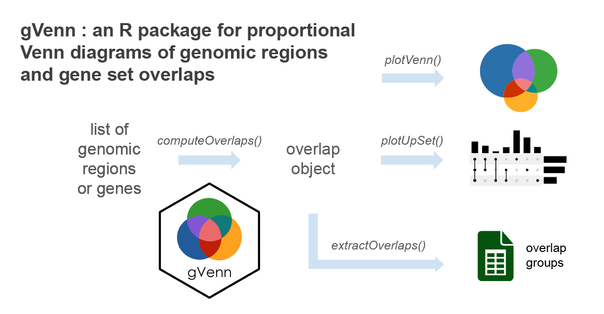
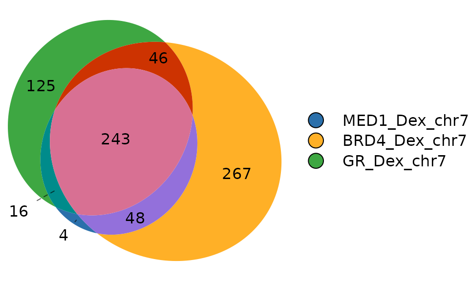
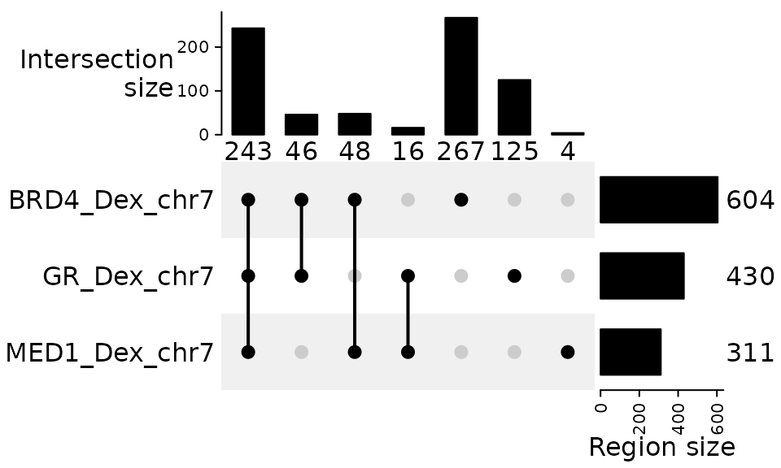
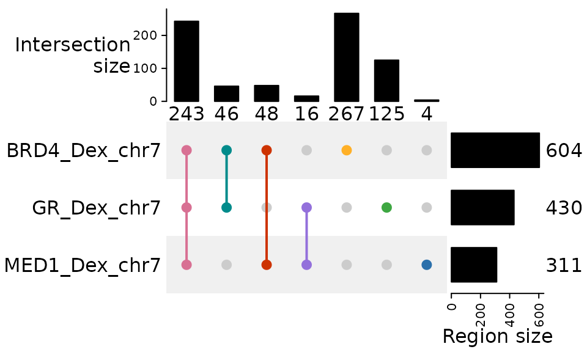
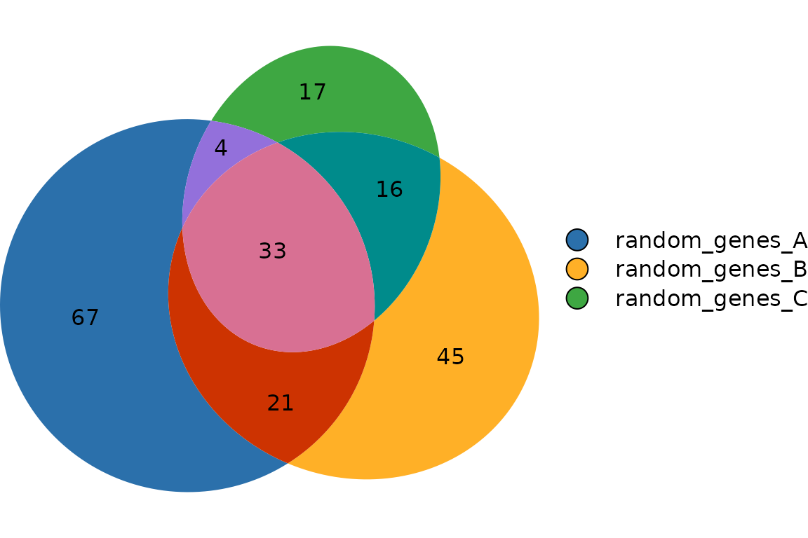
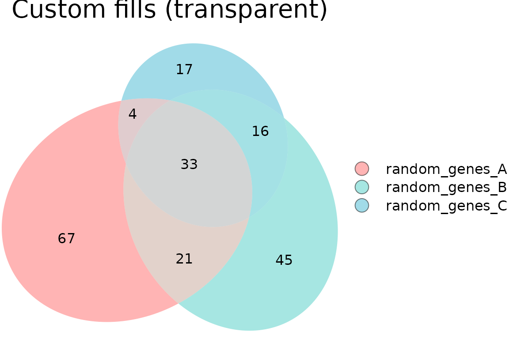
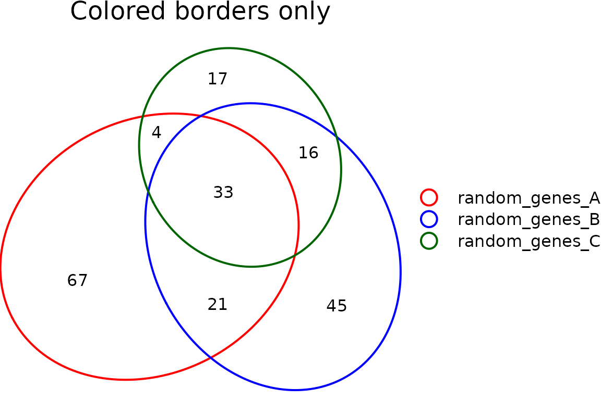
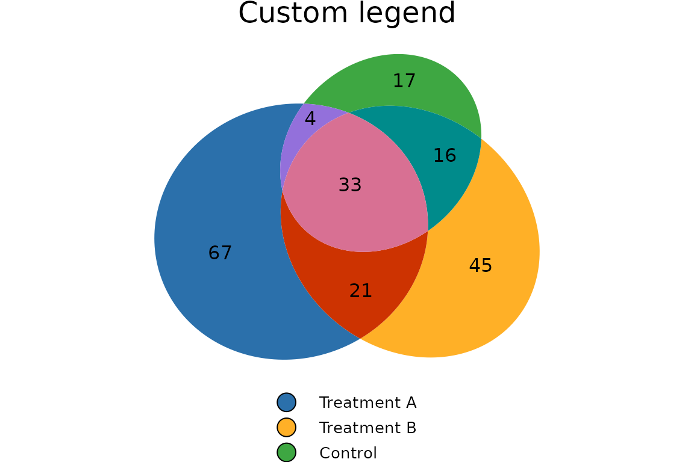
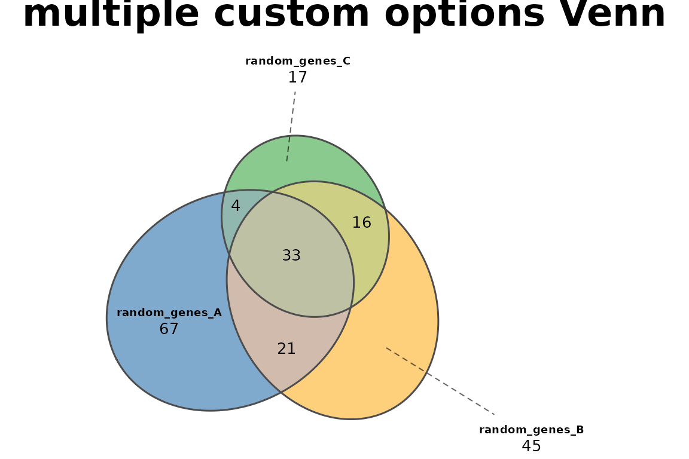

# gVenn: Proportional Venn diagrams for genomic regions and gene set overlaps


## Introduction

**gVenn** stands for **gene/genomic Venn**.  
It provides tools to compute overlaps between genomic regions or sets of
genes and visualize them as **Venn** diagrams with areas proportional to
the number of overlapping elements. In addition, the package can
generate **UpSet** plots for cases with many sets, offering a clear
alternative to complex Venn diagrams.

With seamless support for `GRanges` and `GRangesList` objects, **gVenn**
integrates naturally into Bioconductor workflows such as ChIP-seq,
ATAC-seq, or other interval-based analyses.

Overlap groups can be easily extracted for further analysis, such as
motif enrichment, transcription factor binding enrichment, or gene
annotation. **gVenn** package produces clean, publication-ready figures.

  
  

## Installation

The gVenn package is available through Bioconductor and GitHub.

You can install it from Bioconductor using:

``` r

if (!require("BiocManager", quietly = TRUE))
    install.packages("BiocManager")
BiocManager::install("gVenn")
```

To install the development version from GitHub, use:

``` r

# install.packages("pak")  # if not already installed
pak::pak("ckntav/gVenn")

# or, alternatively:
# install.packages("devtools")  # if not already installed
devtools::install_github("ckntav/gVenn")
```

  

## Example workflow

This section demonstrates a typical workflow with gVenn, from computing
overlaps to generating clean, publication-ready figures. The examples
show how to work with genomic interval data.

We start by loading the package:

``` r

library(gVenn)
```

### 1. Load example ChIP-seq peak sets (genomic)

We use the dataset **`a549_chipseq_peaks`**, which contains example
consensus peak subsets for **MED1**, **BRD4**, and **GR** after
dexamethasone treatment in A549 cells. To keep the dataset small and
suitable for examples and tests, each set has been restricted to peaks
located on *chromosome 7*.

These data originate from Tav *et al.* (2023)
([doi:10.3389/fgene.2023.1237092](https://doi.org/10.3389/fgene.2023.1237092)).

``` r

# Load the example A549 ChIP-seq peaks (subset on chr7 for demo)
data(a549_chipseq_peaks)
```

### 2. Compute overlaps between genomic regions

We compute overlaps between the ChIP-seq peak sets using
[`computeOverlaps()`](https://ckntav.github.io/gVenn/reference/computeOverlaps.md).

For genomic inputs, the `mode` argument selects where the boundaries of
the partition fall:

- With `mode = "reduce"` (the default),
  [`GenomicRanges::reduce()`](https://rdrr.io/pkg/IRanges/man/inter-range-methods.html)
  collapses the union of all intervals into a non-redundant collection
  of “reduced regions”.
- With `mode = "disjoin"`, each set’s intervals are collapsed
  individually and the union is then cut at every set boundary with
  [`GenomicRanges::disjoin()`](https://rdrr.io/pkg/IRanges/man/inter-range-methods.html),
  yielding a larger number of smaller, position-exact “disjoint
  regions”.

Each reduced or disjoint region is then assigned to an overlap group
according to the input sets it overlaps. The counts reported below are
therefore numbers of regions, not of input peaks.

See
[`?computeOverlaps`](https://ckntav.github.io/gVenn/reference/computeOverlaps.md)
for more details.

``` r

genomic_overlaps <- computeOverlaps(a549_chipseq_peaks, mode = "reduce")
```

The result is a structured `GenomicOverlapResult` object that contains:

- `regions`: a `GRanges` object of the reduced (or disjoint) regions,
  each annotated with an `intersect_category` column giving the binary
  code of its overlap group.
- `overlap_matrix`: a logical matrix indicating which regions overlap
  with which input sets (rows = regions, columns = sets).
- `mode`: the `mode` used to build the regions.

#### Strand

By default, regions on opposite strands are never merged or considered
overlapping. Set `ignore.strand = TRUE` to disregard strand:

``` r

D <- GRanges("chr1", IRanges(100, 200), strand = "+")
E <- GRanges("chr1", IRanges(150, 250), strand = "-")
computeOverlaps(list(D = D, E = E))$regions
#> GRanges object with 2 ranges and 1 metadata column:
#>       seqnames    ranges strand | intersect_category
#>          <Rle> <IRanges>  <Rle> |        <character>
#>   [1]     chr1   100-200      + |                 10
#>   [2]     chr1   150-250      - |                 01
#>   -------
#>   seqinfo: 1 sequence from an unspecified genome; no seqlengths
computeOverlaps(list(D = D, E = E), ignore.strand = TRUE)$regions
#> GRanges object with 1 range and 1 metadata column:
#>       seqnames    ranges strand | intersect_category
#>          <Rle> <IRanges>  <Rle> |        <character>
#>   [1]     chr1   100-250      * |                 11
#>   -------
#>   seqinfo: 1 sequence from an unspecified genome; no seqlengths
```

### 3. Visualization

#### Venn diagram

[`plotVenn()`](https://ckntav.github.io/gVenn/reference/plotVenn.md)
draws proportional Venn diagrams from the overlap object.

``` r

plotVenn(genomic_overlaps)
#> ✔ Venn diagError = 2.229e-12  (<= 1e-06)
#>   Access fit diagnostics with attr(<plotVenn output>, "fit_diagnostics")
```

  

##### Fit diagnostics

An area-proportional diagram is not always attainable.
[`plotVenn()`](https://ckntav.github.io/gVenn/reference/plotVenn.md)
prints `diagError`, the largest difference between the share of the
diagram’s area a region receives and the share its count requires, and
names any region left with no area. A diagram is considered accurate
when `diagError` is at most 1e-6 (Micallef and Rodgers, 2014). The
diagnostics are attached to the plot:

``` r

venn <- plotVenn(genomic_overlaps, verbose = FALSE)
attr(venn, "fit_diagnostics")$diagError
#> [1] 7.332685e-13
```

When `diagError` exceeds 1e-6,
[`plotVennError()`](https://ckntav.github.io/gVenn/reference/plotVennError.md)
shows which regions are misrepresented and in which direction.

If some regions are left undrawn, or the fit is poor, use
[`plotUpSet()`](https://ckntav.github.io/gVenn/reference/plotUpSet.md),
which represents every count exactly as a bar.

#### UpSet plot

For more than **three sets**, a Venn diagram with **areas exactly
proportional** to all intersections is **generally not mathematically
attainable**. Solvers (like those used by `eulerr`) provide
**best-effort approximations**, but the layout can become hard to read.
In these cases, an **UpSet plot** is the recommended visualization
because it scales cleanly to many sets and preserves intersection sizes
precisely on bar axes.

We therefore suggest using
[`plotUpSet()`](https://ckntav.github.io/gVenn/reference/plotUpSet.md)
when you have **\> 3 sets** (or any time the Venn becomes visually
crowded).

``` r

plotUpSet(genomic_overlaps)
```



  

You can customize the colors of the combination matrix dots and
connecting lines using the `comb_col` parameter. This parameter accepts
a single color or a vector of colors:

``` r

plotUpSet(genomic_overlaps, comb_col = c( "#D87093",  "#CD3301", "#9370DB", "#008B8B", "#2B70AB", "#FFB027", "#3EA742"))
```



  

#### Export visualization

You can export any visualization using
[`saveViz()`](https://ckntav.github.io/gVenn/reference/saveViz.md):

``` r

venn <- plotVenn(genomic_overlaps)
saveViz(venn,
        output_dir = ".",
        output_file = "figure_gVenn",
        format = "pdf")
```

By default:

- files are written to the current directory (“.”).
- the current date is prepended to the filename (set `with_date = FALSE`
  to disable it).

You can also export to PNG or SVG:

``` r

# png
saveViz(venn,
        output_dir = ".",
        output_file = "figure_gVenn",
        format = "png")

# svg
saveViz(venn,
        output_dir = ".",
        output_file = "figure_gVenn",
        format = "svg")
```

By default, the background is white. For presentations or publications
with colored backgrounds, figures can be exported with a transparent
background using `bg = "transparent"`:

``` r

# png
saveViz(venn,
        output_dir = ".",
        output_file = "figure_gVenn_transparent",
        format = "png",
        bg = "transparent")

# svg
saveViz(venn,
        output_dir = ".",
        output_file = "figure_gVenn_transparent",
        format = "svg",
        bg = "transparent")
```

### 4. Extract elements per overlap group

``` r

groups <- extractOverlaps(genomic_overlaps)
```

``` r

# Display the number of genomic regions per overlap group
sapply(groups, length)
#> group_010 group_001 group_100 group_110 group_011 group_101 group_111 
#>       267       125         4        48        46        16       243
```

In this example:

- 243 reduced regions are shared across all three factors (MED1, BRD4,
  and GR)
- 267 reduced regions are unique to BRD4
- 48 reduced regions are shared between MED1 and BRD4 only

  

#### Overlap group naming

When overlaps are computed, each group of elements or genomic regions is
labeled with a binary code that indicates which sets the element belongs
to.

- Each digit in the code corresponds to one input set (e.g., A, B, C).
- A 1 means the element is present in that set, while 0 means absent.
- The group names in the output are prefixed with “group\_” for clarity.

| Group name  | Meaning                       |
|-------------|-------------------------------|
| `group_100` | Elements only in **A**        |
| `group_010` | Elements only in **B**        |
| `group_001` | Elements only in **C**        |
| `group_110` | Elements in **A ∩ B** (not C) |
| `group_101` | Elements in **A ∩ C** (not B) |
| `group_011` | Elements in **B ∩ C** (not A) |
| `group_111` | Elements in **A ∩ B ∩ C**     |

  

#### Extract one particular group

Each overlap group can be accessed directly by name for downstream
analyses, including motif enrichment, transcription factor (TF)
enrichment, annotation of peaks to nearby genes, functional enrichment
or visualization.

For example, to extract all regions that are present in **A ∩ B ∩ C**:

``` r

# Extract elements in group_111 (present in all three sets: MED1, BRD4, and GR)
regions_in_all_sets <- groups[["group_111"]]

# Display the elements
regions_in_all_sets
#> GRanges object with 243 ranges and 1 metadata column:
#>         seqnames              ranges strand | intersect_category
#>            <Rle>           <IRanges>  <Rle> |        <character>
#>     [1]     chr7     1156721-1157555      * |                111
#>     [2]     chr7     1520256-1521263      * |                111
#>     [3]     chr7     2309811-2310529      * |                111
#>     [4]     chr7     3027924-3028466      * |                111
#>     [5]     chr7     3436651-3437214      * |                111
#>     ...      ...                 ...    ... .                ...
#>   [239]     chr7 158431413-158433728      * |                111
#>   [240]     chr7 158818200-158819318      * |                111
#>   [241]     chr7 158821076-158821876      * |                111
#>   [242]     chr7 158863108-158864616      * |                111
#>   [243]     chr7 159015311-159016245      * |                111
#>   -------
#>   seqinfo: 24 sequences from an unspecified genome; no seqlengths
```

  

#### Export overlap groups

Each overlap group (e.g., `group_100`, `group_110`, `group_111`) can be
exported for downstream analysis. The gVenn package provides two export
functions depending on your data type and downstream needs:

  

##### For all overlap types (genomic or gene sets):

The function
[`exportOverlaps()`](https://ckntav.github.io/gVenn/reference/exportOverlaps.md)
writes each group to an Excel file with one sheet per overlap group,
making it easy to review and reuse the results outside of R.

``` r

# export overlaps to Excel file
exportOverlaps(groups,
               output_dir = ".",
               output_file = "overlap_groups")
```

  

##### For genomic overlaps only:

When working with genomic regions (GRanges objects), you can export
overlap groups as BED files using
[`exportOverlapsToBed()`](https://ckntav.github.io/gVenn/reference/exportOverlapsToBed.md).
This creates one BED file per overlap group, which is ideal for
visualization in genome browsers (IGV, UCSC Genome Browser) or for
downstream analyses requiring BED format input.

``` r

# Export genomic overlaps to BED files
exportOverlapsToBed(groups,
                    output_dir = ".",
                    with_date = FALSE,
                    output_prefix = "overlaps")

# This will create separate BED files such as:
# - overlaps_group_100.bed
# - overlaps_group_110.bed
# - overlaps_group_111.bed
# etc.
```

  

## Customization examples

This section shows common ways to customize the Venn diagram produced by
[`plotVenn()`](https://ckntav.github.io/gVenn/reference/plotVenn.md).
All examples use the built-in `gene_list` dataset.

``` r

# load the example gene_list
data(gene_list)

# compute overlaps between gene sets
res_sets <- computeOverlaps(gene_list)

# basic default venn plot (uses package defaults)
plotVenn(res_sets)
#> ✔ Venn diagError = 7.471e-13  (<= 1e-06)
#>   Access fit diagnostics with attr(<plotVenn output>, "fit_diagnostics")
```

  

##### Custom fills with transparency

``` r

plotVenn(res_sets,
         fills = list(fill = c("#FF6B6B", "#4ECDC4", "#45B7D1"), alpha = 0.5),
         legend = "right",
         main = list(label = "Custom fills (transparent)", fontsize = 14))
#> ✔ Venn diagError = 8.693e-13  (<= 1e-06)
#>   Access fit diagnostics with attr(<plotVenn output>, "fit_diagnostics")
```

  

##### Colored edges, no fills (colored borders only)

``` r

plotVenn(res_sets,
         fills = "transparent",
         edges = list(col = c("red", "blue", "darkgreen"), lwd = 2),
         main = list(label = "Colored borders only"))
#> ✔ Venn diagError = 8.693e-13  (<= 1e-06)
#>   Access fit diagnostics with attr(<plotVenn output>, "fit_diagnostics")
```

  

##### Custom labels and counts + percentages

``` r

plotVenn(res_sets,
         labels = list(col = "black", fontsize = 12, font = 2),
         quantities = list(type = c("counts","percent"),
                           col = "black", fontsize = 10),
         main = list(label = "Counts + Percentages", fontsize = 14))
#> ✔ Venn diagError = 8.693e-13  (<= 1e-06)
#>   Access fit diagnostics with attr(<plotVenn output>, "fit_diagnostics")
```

  

##### Legend at the bottom with custom text

``` r

plotVenn(res_sets,
         legend = list(side = "bottom",
                       labels = c("Treatment A","Treatment B","Control"),
                       fontsize = 10),
         main = list(label = "Custom legend"))
#> ✔ Venn diagError = 2.510e-14  (<= 1e-06)
#>   Access fit diagnostics with attr(<plotVenn output>, "fit_diagnostics")
```

  

##### Combining multiple custom options

``` r

plotVenn(res_sets,
         fills = list(fill = c("#2B70AB", "#FFB027", "#3EA742"), alpha = 0.6),
         edges = list(col = "gray30", lwd = 1.5),
         labels = list(col = "black", fontsize = 7, font = 2),
         quantities = list(type = "counts", col = "black", fontsize = 10),
         main = list(label = "multiple custom options Venn", fontsize = 16, font = 2),
         legend = FALSE)
#> ✔ Venn diagError = 8.693e-13  (<= 1e-06)
#>   Access fit diagnostics with attr(<plotVenn output>, "fit_diagnostics")
```

  

## Session info

This vignette was built with the following R session:

``` r

sessionInfo()
#> R version 4.6.1 (2026-06-24)
#> Platform: x86_64-pc-linux-gnu
#> Running under: Ubuntu 24.04.5 LTS
#> 
#> Matrix products: default
#> BLAS:   /usr/lib/x86_64-linux-gnu/openblas-pthread/libblas.so.3 
#> LAPACK: /usr/lib/x86_64-linux-gnu/openblas-pthread/libopenblasp-r0.3.26.so;  LAPACK version 3.12.0
#> 
#> locale:
#>  [1] LC_CTYPE=C.UTF-8       LC_NUMERIC=C           LC_TIME=C.UTF-8       
#>  [4] LC_COLLATE=C.UTF-8     LC_MONETARY=C.UTF-8    LC_MESSAGES=C.UTF-8   
#>  [7] LC_PAPER=C.UTF-8       LC_NAME=C              LC_ADDRESS=C          
#> [10] LC_TELEPHONE=C         LC_MEASUREMENT=C.UTF-8 LC_IDENTIFICATION=C   
#> 
#> time zone: UTC
#> tzcode source: system (glibc)
#> 
#> attached base packages:
#> [1] stats4    stats     graphics  grDevices utils     datasets  methods  
#> [8] base     
#> 
#> other attached packages:
#> [1] gVenn_1.99.0         GenomicRanges_1.64.0 Seqinfo_1.2.0       
#> [4] IRanges_2.46.0       S4Vectors_0.50.3     BiocGenerics_0.58.1 
#> [7] generics_0.1.4      
#> 
#> loaded via a namespace (and not attached):
#>  [1] eulerr_8.3.1          sass_0.4.10           shape_1.4.6.1        
#>  [4] stringi_1.8.9         magrittr_2.0.5        digest_0.6.39        
#>  [7] evaluate_1.0.5        grid_4.6.1            timechange_0.4.0     
#> [10] RColorBrewer_1.1-3    iterators_1.0.14      circlize_0.4.18      
#> [13] fastmap_1.2.0         foreach_1.5.2         doParallel_1.0.17    
#> [16] jsonlite_2.0.0        GenomeInfoDb_1.48.0   GlobalOptions_0.1.4  
#> [19] httr_1.4.9            ComplexHeatmap_2.28.0 UCSC.utils_1.8.0     
#> [22] codetools_0.2-20      textshaping_1.0.5     jquerylib_0.1.4      
#> [25] cli_3.6.6             rlang_1.3.0           crayon_1.5.3         
#> [28] cachem_1.1.0          yaml_2.3.12           otel_0.2.0           
#> [31] tools_4.6.1           parallel_4.6.1        colorspace_2.1-3     
#> [34] GetoptLong_1.1.1      vctrs_0.7.3           R6_2.6.1             
#> [37] png_0.1-9             matrixStats_1.5.0     lifecycle_1.0.5      
#> [40] lubridate_1.9.5       stringr_1.6.0         fs_2.1.0             
#> [43] clue_0.3-68           cluster_2.1.8.2       ragg_1.5.2           
#> [46] desc_1.4.3            pkgdown_2.2.1         bslib_0.12.0         
#> [49] glue_1.8.1            systemfonts_1.3.2     xfun_0.61            
#> [52] knitr_1.52            rjson_0.2.23          htmltools_0.5.9      
#> [55] rmarkdown_2.32        compiler_4.6.1
```

## References

#### Example A549 ChIP-seq dataset

- Tav, C., Fournier, É., Fournier, M., Khadangi, F., Baguette, A., Côté,
  M.C., Silveira, M.A.D., Bérubé-Simard, F.-A., Bourque, G., Droit, A.,
  & Bilodeau, S. (2023). *Glucocorticoid stimulation induces
  regionalized gene responses within topologically associating domains.*
  **Frontiers in Genetics**, 14, 1237092.
  [doi:10.3389/fgene.2023.1237092](https://doi.org/10.3389/fgene.2023.1237092)

#### Supporting packages

- **eulerr** : Larsson, J., & Gustafsson, P. (2018). *A Case Study in
  Fitting Area-Proportional Euler Diagrams with Ellipses Using eulerr.*
  **Proceedings of International Workshop on Set Visualization and
  Reasoning**, CEUR Workshop Proceedings, 2116, 84–91.
  [ceur-ws.org/Vol-2116/paper7.pdf](https://ceur-ws.org/Vol-2116/paper7.pdf)

- **ComplexHeatmap** : Gu, Z., Eils, R., & Schlesner, M. (2016).
  *Complex heatmaps reveal patterns and correlations in multidimensional
  genomic data.* **Bioinformatics**, 32(18), 2847–2849.
  [doi:10.1093/bioinformatics/btw313](https://doi.org/10.1093/bioinformatics/btw313)
